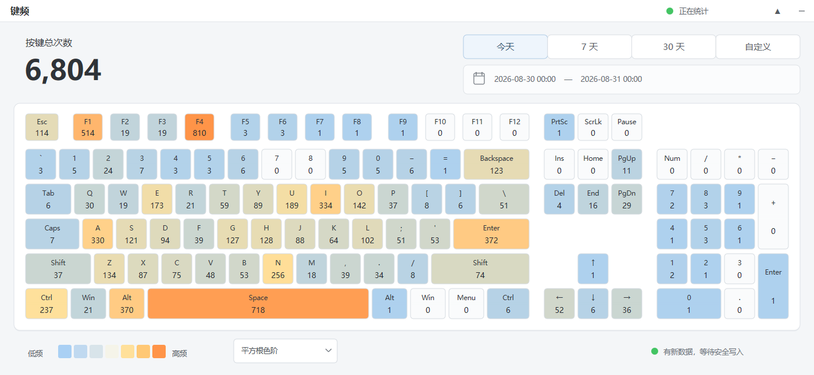

# KeyPulse（键频）



KeyPulse 是一个轻量的 Windows 键盘使用频率统计工具。它通过 Raw Input 在窗口失焦、隐藏到托盘后继续接收键盘设备事件，并使用 Win32、Direct2D 和 DirectWrite 绘制键盘热力图。

程序只保存“某个扫描码在某个自然日被按下多少次”。它不记录输入字符、按键顺序、精确时间、活动程序或窗口标题，无法通过统计文件还原输入内容。

## 功能

- 以 Raw Input 为主通道统计全局键盘按下次数，并用低级键盘钩子补齐部分系统组合键事件；每次物理按下只计一次，长按产生的系统重复事件不重复计数。
- 区分左右 `Ctrl` / `Alt`、主键区与数字小键盘、方向键与导航键。
- 支持今天、最近 7 天、最近 30 天和自定义日期范围。
- 提供平方根、线性、对数和分位数四种临时热力染色方式。
- 支持完整与精简两种显示模式；完整模式按钮显示 `▲`，精简模式显示 `▼`。
- 关闭窗口后留在通知区域继续统计，可从托盘暂停、恢复、切换显示模式或退出。
- 数据按自然日聚合，有新数据时最多每 5 分钟写盘一次。
- EXE 内嵌多分辨率程序图标，资源管理器、任务栏和通知区域均使用 KeyPulse 图标。
- 不依赖第三方运行时、数据库服务或额外 DLL。

## 系统要求

- Windows 7 或更高版本；建议 Windows 7 用户安装 SP1 和可用的系统更新。
- x86 与 x64 均可从源码构建，下面的示例使用 x64。

Windows 7/8 使用系统 DPI 感知；支持较新 DPI API 的系统会自动使用按显示器 DPI。Windows 10 1703 及更高版本使用 Per-Monitor V2。Windows 10 才提供的 DPI 查询 API 通过运行时探测调用，不会成为 Windows 7 的加载依赖。

Raw Input 仍受系统和硬件边界限制：UAC 安全提示、登录与锁屏等安全桌面不会向普通桌面程序发送事件；许多笔记本的 `Fn` 键由键盘固件直接处理；程序未运行时无法统计。

## 系统组合键兼容

仅使用 Raw Input 时，部分 Windows 版本或输入法路径可能会先处理系统保留快捷键，导致组合中的普通键没有到达后台接收窗口。例如，按下 `Alt+Tab` 时可能只统计到 Alt 键而遗漏 Tab。

KeyPulse 使用双通道采集解决这一问题：

- Raw Input 仍是主通道，负责绝大多数硬件键盘事件。
- 独立消息线程上的 `WH_KEYBOARD_LL` 只读旁路跟踪按下/抬起状态，并补齐系统组合键中缺失的按下事件。
- 旁路始终继续调用后续钩子，不屏蔽、不重映射按键。
- 两个通道按扫描码和系统消息时间戳配对；已由 Raw Input 收到的事件不会重复统计，仅旁路收到的事件会在等待 80 ms 后补计。
- 带 `LLKHF_INJECTED` 标记的软件注入事件不会进入补偿通道。

该增强不改变统计文件格式，也不会额外保存组合关系、按键顺序或事件时间戳。

## 使用

启动 `KeyPulse.exe` 后即开始统计。标题栏右侧的短横按钮会隐藏窗口，但程序仍在后台运行；单击标题栏状态可暂停或继续统计。右键通知区域图标可以重新打开窗口或真正退出程序。

默认数据文件位于：

```text
%LOCALAPPDATA%\KeyPulse\stats.kpf
```

同目录下的 `.bak` 是上一个有效备份，`.tmp` 只在写入过程中临时使用。卸载程序时如需一并清除统计数据，可以删除整个 `%LOCALAPPDATA%\KeyPulse` 目录。

## 从源码构建

准备以下工具：

- Visual Studio，并安装“使用 C++ 的桌面开发”工作负载；
- Windows SDK；
- CMake 3.20 或更高版本。

在仓库根目录运行：

```powershell
cmake -S . -B build -A x64
cmake --build build --config Release
ctest --test-dir build -C Release --output-on-failure
```

生成的程序位于 `build\bin\KeyPulse.exe`。程序使用静态 MSVC 运行库；目标电脑无需另行安装 Visual C++ Redistributable。

构建 32 位版本时，将生成器平台改为 `Win32`：

```powershell
cmake -S . -B build-x86 -A Win32
cmake --build build-x86 --config Release
```

也可以通过 `KEYPULSE_RUNTIME_OUTPUT_DIRECTORY` 指定程序输出目录：

```powershell
cmake -S . -B build -A x64 -DKEYPULSE_RUNTIME_OUTPUT_DIRECTORY=dist
```

## 采集与存储设计

### 按键采集

- 注册 HID Generic Desktop / Keyboard（Usage Page `0x01`、Usage `0x06`），使用 `RIDEV_INPUTSINK | RIDEV_DEVNOTIFY` 接收全局 `WM_INPUT`。
- 在独立消息线程安装只读的 `WH_KEYBOARD_LL` 旁路；它不拦截或修改按键，只补齐可能被系统热键路径截走的事件。
- Raw Input 与旁路分别根据按下/抬起事件维护按键状态，仅把从抬起到按下的状态变化送入配对；匹配项只计数一次，旁路独有事件等待 80 ms 后再补计。
- 忽略带 `LLKHF_INJECTED` 标记的软件注入事件，保持与硬件 Raw Input 的统计口径一致。
- 同时接收 make（按下）和 break（抬起）事件以维护状态，但只在按键从抬起变为按下时计数。
- 以 Set-1 make code 加 E0/E1 前缀作为键 ID，共预留 768 个计数槽位。
- 过滤 Print Screen 兼容序列中的伪 Shift，并规范化 Print Screen 与 Pause。
- 未绘制在键盘上的合法扫描码仍会计入总数并保存到对应槽位。

### 数据文件

自定义二进制格式 `KYPULSE1` 使用小端编码：

- 40 字节文件头保存 magic、格式版本、键槽数量、自然日记录数、负载长度以及 CRC32。
- 每个自然日一条记录，包含一个 `int32` 自然日编号和 768 个 `uint64` 计数。
- 每日记录约 6 KiB，一整年约 2.2 MiB。
- 仅在存在未保存数据时落盘，正常退出时会保存剩余计数。
- 写入先保存到 `.tmp` 并调用 `FlushFileBuffers`，随后原子替换主文件，同时保留 `.bak`。
- 加载时校验文件头和负载；主文件损坏时自动尝试备份，不会把损坏内容静默当成有效数据。

## 源码结构

- `src/main.cpp`：Win32 生命周期、Raw Input、通知区域、日期控件和 Direct2D/DirectWrite 界面。
- `src/input_merge.cpp` / `src/input_merge.h`：Raw Input 与低级钩子事件的时间戳配对、去重和缺失补偿。
- `src/input_merge_tests.cpp`：双通道先后顺序、长按去重、再次按下、补偿延迟和时间戳回绕测试。
- `src/storage.cpp` / `src/storage.h`：按日聚合、CRC32、二进制序列化、原子保存与备份恢复。
- `src/storage_tests.cpp`：日期查询、序列化往返、损坏检测和备份恢复测试。
- `icon/`：50px/100px 原始 PNG，以及供资源管理器和文件属性使用的多分辨率 `keypulse.ico`；运行时任务栏与托盘仍使用适合深色背景的反色图标。
- `app.manifest`：权限、Windows 版本兼容性和 DPI 感知声明。

## 致谢

感谢以下创作者带来的创意启发：

- [@白羽轻](https://space.bilibili.com/868898)
- [@马猴少年源神](https://space.bilibili.com/2870557)

代码由 ChatGPT 5.6 Sol / Codex 实现。
